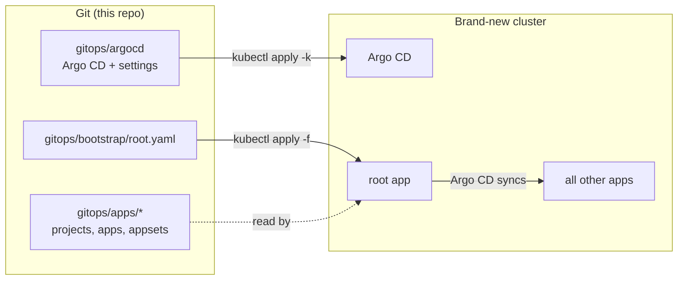

# Argo CD disaster recovery workshop

Your Argo CD cluster is gone. How long until everything is back?

In this workshop you run the same Argo CD setup twice, then destroy the cluster each time:

1. **ClickOps.** You create apps in the UI and CLI. Then the cluster burns down, and you try to rebuild them from memory.
2. **GitOps.** The same setup, but everything is declared in this repository. The cluster burns down again, and you recover it with two commands.



## What you need

- A GitHub account with Codespaces access.
- About 90 minutes.
- Basic Kubernetes knowledge. No prior Argo CD experience is needed.

## Labs

| Lab | What you do | Time |
| --- | --- | --- |
| [0. Setup](docs/00-setup.md) | Fork, open a Codespace, point the manifests at your fork | 10 min |
| [1. Life with ClickOps](docs/01-clickops.md) | Install Argo CD, create three apps in the UI and CLI | 20 min |
| [2. Disaster #1](docs/02-clickops-disaster.md) | Lose the cluster and rebuild by hand | 15 min |
| [3. Life with GitOps](docs/03-gitops.md) | Bootstrap Argo CD from Git, make changes through Git | 20 min |
| [4. Disaster #2](docs/04-gitops-disaster.md) | Lose the cluster and recover in two commands | 10 min |
| [5. Wrap-up](docs/05-wrap-up.md) | What Git does not save you from | 10 min |

Facilitators: see [docs/facilitator.md](docs/facilitator.md).

## Repository layout

```text
.devcontainer/          Codespaces definition (Docker, kind, kubectl, argocd CLI)
gitops/
  argocd/               Argo CD itself, plus its settings, as a Kustomize overlay
  bootstrap/root.yaml   The root ("app of apps") Application, the only thing applied by hand
  apps/                 Every project, Application and ApplicationSet the root app manages
scripts/                Helpers behind the make targets
Makefile                Run `make help`
```
